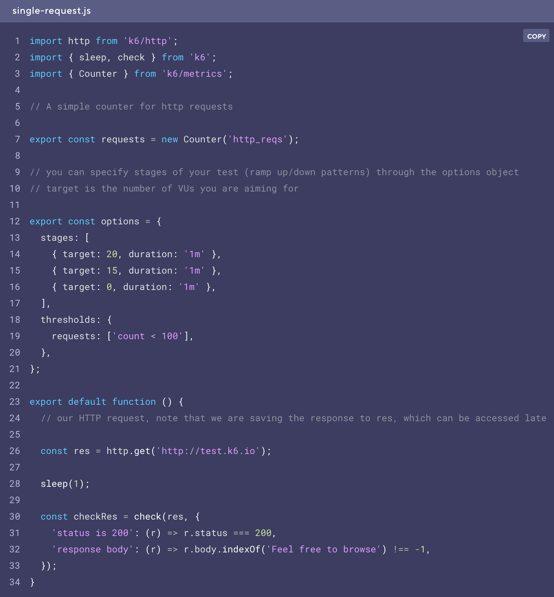
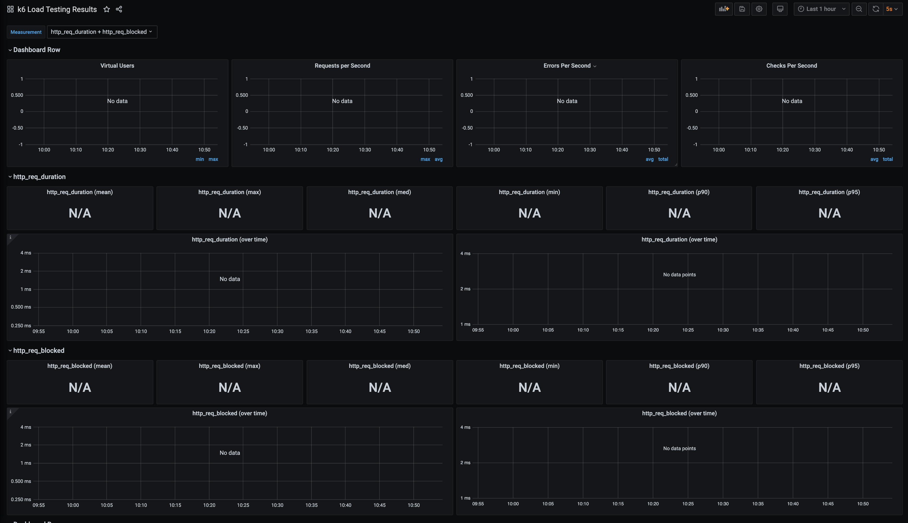

<h2>Load testing with K6, influxDB and Grafana </h2>

<p> 
Load testing is a very important part of the development process. 
It will allow you to know where are your operation limits, so you can take actions over your infrastructure, databases or even the programming language / framework you are using

Once you follow the next instructions, you will be able to execute load testing using k6 and store the results to a timeline database as influxdb. 
Grafana have an integration with influx, so we can use the results to make graphics and configure alerts for you to know if your system is up/down/suffering or simply if you want to!
</p>

<h4> Prerequisites </h4>

 <ul>
     <li> <a href="https://www.python.org/downloads/"> Python </a> + <a href="https://pip.pypa.io/en/stable/installing/"> Pip </a> </li>
     <li> <a href="https://docs.ansible.com/ansible/latest/installation_guide/intro_installation.html">Ansible</a> </li>
 </ul>
 
 
 <h3> Set up </h3>
 
 <p> Now, we need to install k6, docker and docker compose. We are going to install them by using an ansible playbook. 
 Once these techs are installed in your local machine, influxDB and grafana will be started by docker-compose. </p>
 
 > sh exec.sh
 

```
Grafana will be running on PORT 3000, to login go to localhost:3000 and use these credentials [user/pass]: admin/admin
```
To create an awesome dashboard to display the results of your load testings in grafana, <a href="https://grafana.com/grafana/dashboards/2587">you can use this dashboard</a>


```
Influxdb will be running on PORT 8086
```


<h2> Running your first k6 test!</h2>

<p> You can copy the next example from the official k6 documentations - <a href="https://k6.io/docs/examples/single-request">examples</a> -

</img>

Now, execute:

> k6 run single_request.js --out influxdb=http://localhost:8086/myk6db


Once your test is done, you can go to your dashboard in grafana and see something like this:

</img>
